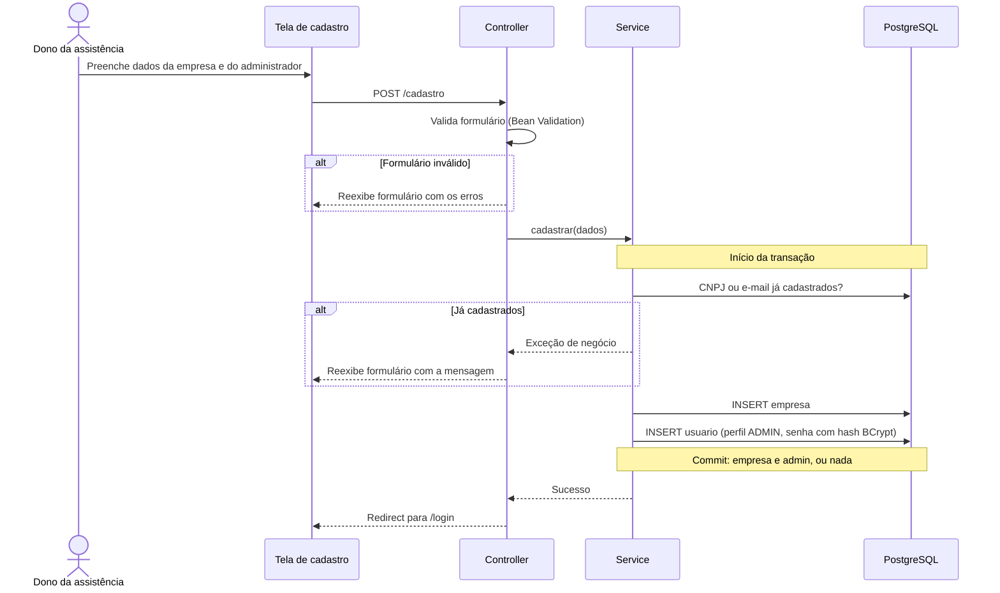
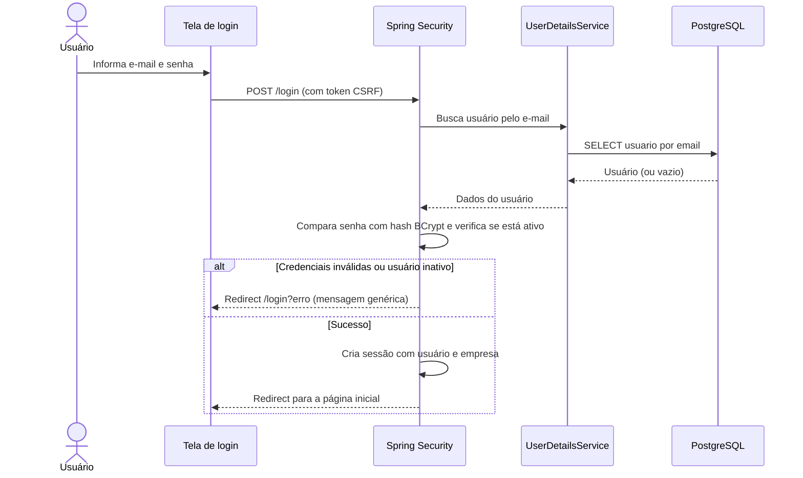

# Fluxos

> Status: 🟡 **planejado**. Os fluxos descrevem o comportamento esperado e servem de guia para a implementação.

## US01: Autocadastro da assistência técnica

```mermaid
sequenceDiagram
    actor Dono as Dono da assistência
    participant Tela as Tela de cadastro
    participant C as Controller
    participant S as Service
    participant DB as PostgreSQL

    Dono->>Tela: Preenche dados da empresa e do administrador
    Tela->>C: POST /cadastro
    C->>C: Valida formulário (Bean Validation)
    alt Formulário inválido
        C-->>Tela: Reexibe formulário com os erros
    end
    C->>S: cadastrar(dados)
    Note over S,DB: Início da transação
    S->>DB: CNPJ ou e-mail já cadastrados?
    alt Já cadastrados
        S-->>C: Exceção de negócio
        C-->>Tela: Reexibe formulário com a mensagem
    end
    S->>DB: INSERT empresa
    S->>DB: INSERT usuario (perfil ADMIN, senha com hash BCrypt)
    Note over S,DB: Commit: empresa e admin, ou nada
    S-->>C: Sucesso
    C-->>Tela: Redirect para /login
```

## US02: Login

```mermaid
sequenceDiagram
    actor U as Usuário
    participant Tela as Tela de login
    participant SEC as Spring Security
    participant UDS as UserDetailsService
    participant DB as PostgreSQL

    U->>Tela: Informa e-mail e senha
    Tela->>SEC: POST /login (com token CSRF)
    SEC->>UDS: Busca usuário pelo e-mail
    UDS->>DB: SELECT usuario por email
    DB-->>UDS: Usuário (ou vazio)
    UDS-->>SEC: Dados do usuário
    SEC->>SEC: Compara senha com hash BCrypt e verifica se está ativo
    alt Credenciais inválidas ou usuário inativo
        SEC-->>Tela: Redirect /login?erro (mensagem genérica)
    else Sucesso
        SEC->>SEC: Cria sessão com usuário e empresa
        SEC-->>Tela: Redirect para a página inicial
    end
```
